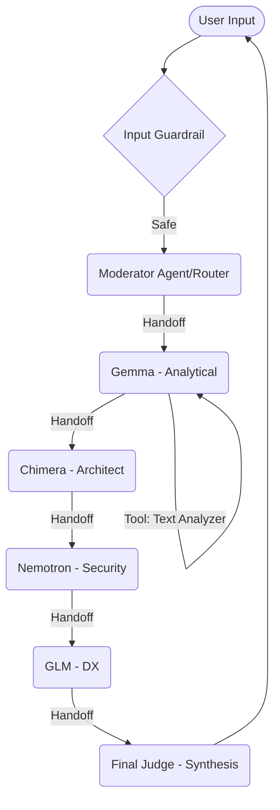

# Agentic AI Round Table Discussion

A multi-agent CLI assistant built using the **OpenAI Agents SDK**. This project demonstrates a sequential "Expert Round Table" discussion where agents delegate tasks using built-in SDK primitives.

## 🚀 Setup & Execution

1. **Install Dependencies**:
   ```bash
   npm install
   ```

2. **Configure Environment**:
   Create a `.env` file with your OpenRouter API Key:
   ```env
   OPENAI_API_KEY=your_openrouter_key
   ```

3. **Run the Project**:
   ```bash
   npm start
   ```

---

## 🏗️ Architecture

The system uses a **Router-Expert Chain** architecture:



### Agents & Roles
- **Moderator (Router)**: The entry point. It evaluates the query and performs the initial handoff. It **never** answers the question directly.
- **Analytical Expert**: Performs a deep-dive analysis. Uses the `text_analyzer` tool to break down the user's prompt.
- **Architect Expert**: Critiques the deep-dive from a scalability and pragmatic perspective.
- **Security/Performance Specialist**: Reviews all previous thoughts for bottlenecks and safety risks.
- **DX Specialist**: Suggests simple, elegant developer experiences.
- **Final Judge**: Synthesizes the entire multi-turn discussion into a single coherent answer.

### Tools
- **Text Analyzer**: A tool used by the Analytical Expert to calculate word count and lexical complexity of the input.

---

## 🧠 Core Concepts (SDK Primitives)

- **Agent**: Defined in `src/agents.ts` with specific instructions and model configurations.
- **Tool**: Implemented in `src/tools.ts` using the `tool()` primitive for grounding AI in data.
- **Handoff**: Sequential flow managed by the `handoff()` primitive, allowing seamless delegation.
- **Guardrail**: A `work_related_check` implemented in `src/guardrails.ts` to block off-topic queries.
- **Runner**: The execution engine in `src/roundtable.ts` that orchestrates the entire multi-agent cycle.

---

## 📝 Theoretical Notes

For full theoretical notes on Agentic AI, Configuration Levels, and SDK concepts, see [NOTES.md](./NOTES.md).
